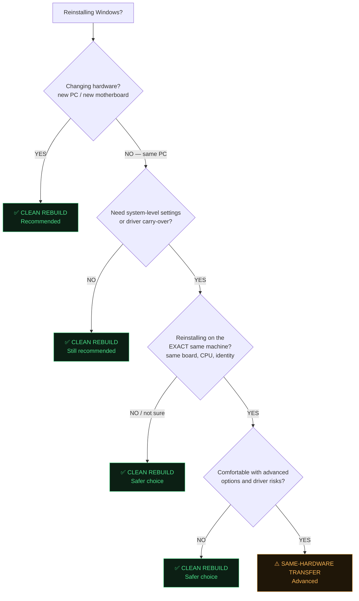

# WinGOES Pro — Mode Selection Guide

| | |
|---|---|
| **Product** | WinGOES Pro 2.1 |
| **Document** | Mode Selection Guide, Rev. 2 |

---

## Which Mode Should I Use?



Plain-text version (for offline reading):

```text
Reinstalling Windows?
 │
 ├─ Changing hardware (new PC / new motherboard)?
 │   └─ YES ─────────────────────────────► ✅ CLEAN REBUILD (recommended)
 │
 └─ NO — same PC
     │
     ├─ Need system-level settings or driver carry-over?
     │   └─ NO ──────────────────────────► ✅ CLEAN REBUILD (still recommended)
     │
     └─ YES
         │
         ├─ EXACT same machine (board, CPU, system identity)?
         │   └─ NO / NOT SURE ───────────► ✅ CLEAN REBUILD (safer choice)
         │
         └─ YES
             │
             ├─ Comfortable with advanced options and driver risks?
             │   └─ NO ──────────────────► ✅ CLEAN REBUILD (safer choice)
             │
             └─ YES ─────────────────────► ⚠️ SAME-HARDWARE TRANSFER (advanced)
```

---

## Mode Summary (Quick Reference)

### ✅ CLEAN REBUILD *(default — recommended)*

| Use when | What it does |
|----------|--------------|
| New PC or upgraded hardware | Reinstalls apps where possible |
| Fresh Windows install | Restores safe, portable configs |
| Eliminating old Windows issues | **Blocks** risky system migrations |
| You are unsure which mode to pick | Windows-settings and driver-transfer toggles are disabled by policy |

### ⚠️ SAME-HARDWARE TRANSFER *(advanced)*

| Use only when | What it allows |
|---------------|----------------|
| Reinstalling on the **same physical machine** | Timezone/region and power-plan restore |
| Hardware fingerprint matches (**PASS**) | DriverStore transfer (gated, opt-in) |
| You understand the risks | Everything CLEAN REBUILD does |

If the hardware fingerprint does **not** match, WinGOES Pro automatically disables the risky features — the engine enforces this even if the UI toggles were on.

### 🧪 CUSTOM *(expert use only)*

Full manual control over toggles, with responsibility on you. Even in CUSTOM: known-dangerous actions (raw registry import, browser passwords, shell-extension migration) remain **permanently blocked**, and driver transfer still requires a hardware-match **PASS**.

---

## How the Hardware Gate Works

During CAPTURE, WinGOES Pro records a fingerprint of your machine (baseboard, CPU, BIOS identity, GPUs, NICs). During APPLY and VERIFY it fingerprints the current machine and classifies the match:

| Match | Meaning | Effect |
|-------|---------|--------|
| **PASS** | Same board + CPU, overlapping NICs | Gated features permitted (if enabled) |
| **PARTIAL** | Some identity overlap | Gated features disabled |
| **FAIL / UNKNOWN** | Different machine or no source fingerprint | Gated features disabled |

You never configure this — it is automatic and cannot be overridden from the UI.

---

## Golden Rule

> **If you ever hesitate, choose CLEAN REBUILD.**
> It is always safe, always supported, and never carries old problems forward.

---

*Copyright © 2026 Leon Priest (7h3v01d) • Apache License 2.0*
